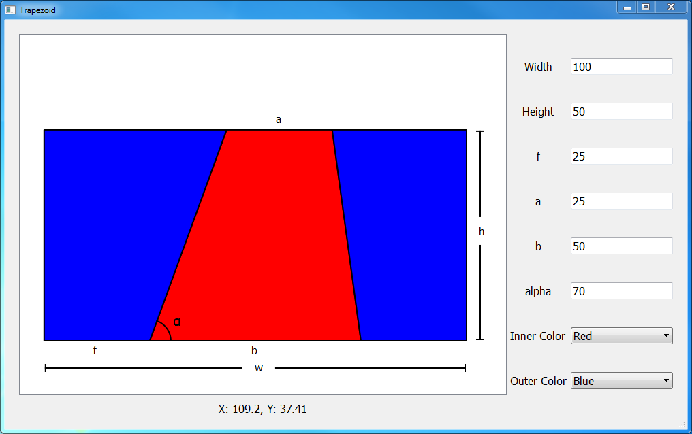

# Trapezoid Item

Left side is a QGraphicsView, which displays a rectangle. The label below it displays the coordinate of the cursor. The origin of the coordinate is the bottom-left point.

Right side are some widgets to set the parameters of the trapezoid. The parameters are:
1 total width of the rectangle;
2 total height of the rectangle;
3 f: position of the lower-left point of the trapezoid;
4 a: width of top base;
5 b: width of bottom base;
6 alpha: angle in degree;
7 Inner Color: color inside the trapezoid;
8 Outer Color: color outside the trapezoid.

Change on any of these widgets will update the plot.
